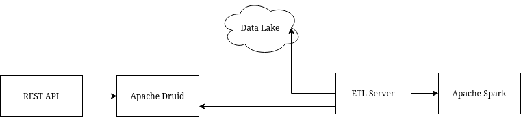

# Data treating demonstration
## Introduction
This repository is the main repository used to demonstrate a environment to read data sent by a customer and set it in a OLAP cube to facilitate data interpretation.

## Architecture

The idea is to read a datalake containing files sent by a customer containing the data he wants to be treated. Using Apache Spark, we can make any ETL transformations needed. In this demonstration, a Python interface is used to read the data and send it to Spark. 

With Apache Druid, we can storage the data in a OLAP database that can be queried through a REST API, in this demonstration made in Node.js. While this API is acting as a simple bridge for now, the idea is to create an API with security levels where the customer can query only for his data in the server.

The datalake folder is simulating a datalake. There, you can see a compressed json file named generated.json.gz containing an array with 10000 objects that has the following format:
```json
{
    "atendimento": {
      "protocolo": 202103608134,
      "data": "14/03/2021 03:23:56",
      "avaliacao": 1.7,
      "status": "NÚMERO ERRADO",
      "operador": "Yasmin Burgess",
      "duracao": "00:20:09.484",
      "telefoneDiscado": "+5586933609184"
    },
    "cliente": {
      "nome": "Monica Vincent",
      "cpf": "43641800383"
    }
  }
```
The data was generated with [JSON Generator](https://www.json-generator.com/).

Using a ETL process, a new JSON will be generated by Spark. Each line will be a separated JSON object (not a JSON array) and will have the following format:
```json
{
  "identifier": "202103608134",
  "evaluation": 1.7,
  "duration": 1209,
  "operator": "Yasmin Burgess",
  "date": "14/03/2021 03:23:56",
  "status": "NÚMERO ERRADO",
  "client": "43641800383",
  "phone": "+5586933609184"
}
```
The biggest changes made are the flattening of the data and converting the field "duracao", which is a time period, into "duration", which is the time converted to seconds.

## Requirements
* Docker 20.10.6
* Docker Compose 1.29.2

Before running the demonstration, be sure to clone the [Spark ETL Server](https://github.com/Ruriel-SCIO/spark-etl-server) and the [REST API](https://github.com/Ruriel-SCIO/simple-rest-server) in a directory above the current one.

After that, the setup is as simple as running a terminal command:
```console
$ docker-compose up --build 
```
Docker will create the containers and download all the required files.
Apache Druid might take awhile to be ready. But once is ready, it will be available on port 8888. Feel free to visit localhost via port 8888 to see Druid interface. [The official Druid website](https://druid.apache.org/docs/latest/tutorials/tutorial-batch.html) has some tutorials describing each part of the interface in case you want to make manual operations.

In this demonstration, the Python interface will read the generated.json.gz file, send it to Apache Spark for the ETL process and then send it directly to Apache Druid. If Druid is not available yet, it will wait for awhile before sending the request. After that, a [task](https://druid.apache.org/docs/latest/ingestion/tasks.html#task-api) will be created. After the task is finished, the data will be available and ready to be queried by the REST API. Please, refer to each repository for details on how each one works.
